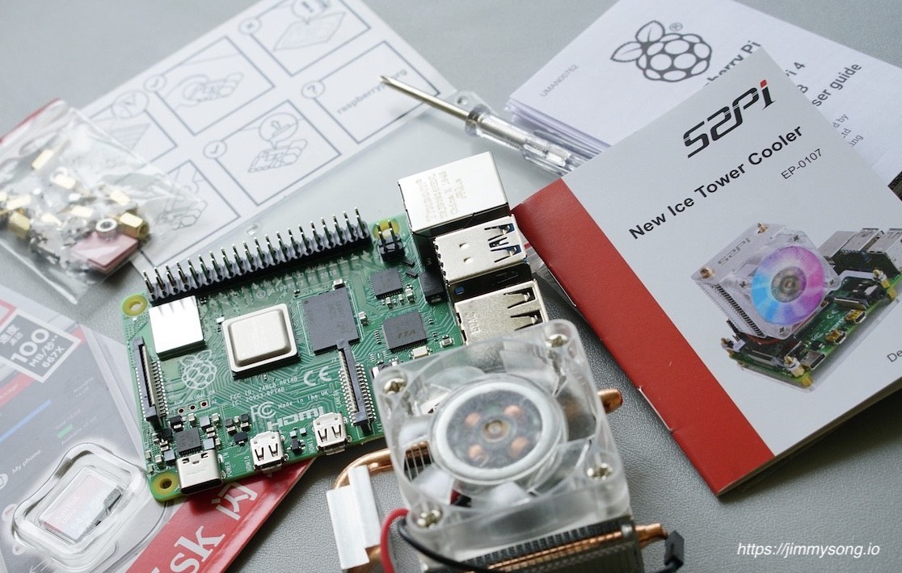
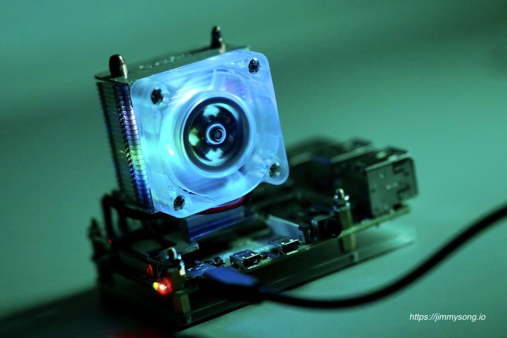

{}
**声明**：
本人与文中的淘宝店铺没有任何利益关系。
{}

巧妇难为无米之炊，在正式开始前，首先你需要准备的是当然就是树莓派本身。

## 硬件信息

笔者的树莓派硬件配置如下：

- 型号：Raspberry Pi 4B
- 配置：4 核 CPU、8G 内存
- 存储卡：64G MicroSD TF 卡

## 购买链接

以下是我在 2020 年 6 月 18 日，通过淘宝购买的树莓派 4 代本体及配件资料，仅供大家参考。

| 商品                                                         | 数量 | 价格 |
| ------------------------------------------------------------ | ---- | ---- |
| [树莓派 4 代 Raspberrypi4b model B Python 编程 linux 开发板 8gb 8g](https://item.taobao.com/item.htm?_u=oba4m7ce8db&id=596761703325)（必选） | 1    | 599  |
| [闪迪（SanDisk）高速 MicroSD TF 卡 Class10-98MB/S 适用于树莓派](https://item.taobao.com/item.htm?_u=oba4m7c4521&id=524240381982)（必选） | 1    | 59   |
| [树莓派 4 代 4B 专用电源适配器 5V 3A Type-C 带开关按钮充电器](https://item.taobao.com/item.htm?_u=oba4m7c6d3c&id=606745265028)（必选） | 1    | 23   |
| [PI-Heatsink kit 为 Raspberry Pi 凉身打造散热片 适用于树莓派](https://item.taobao.com/item.htm?_u=oba4m7c5556&id=44427919831)（可选） | 1    | 6    |
| [树莓派 4 代 CPU 散热器 U 型热管塔式 炫光 RGB 风扇 ICE Tower 冰塔式](https://item.taobao.com/item.htm?spm=a1z09.2.0.0.21f02e8dypBoEv&id=615700329002&_u=oba4m7cd406)（可选） | 1 | 119 |
| **总计**                                                     | **5** | **796** |

下图为以上商品的组图。

## 组装

树莓派本身无需组装，只需安装散热器、存储卡并接通电源即可。树莓派商品包装中内置了说明书（无中文说明），无需阅读。

### 安装散热器

铜铝散热片基本没有用处，而且因为安装了散热器挡住了内存上方的空间，导致无法为内存安装铜制散热片，但 U 盘驱动器上方依然有空间安装散热片。

### 安装存储卡

在安装存储卡之前，需要先向存储卡中写入操作系统。请参考[启动](../boot)。

组装完成后接入电源，黑暗中可以看到散热器的炫光，基本听不到风扇的声音。

